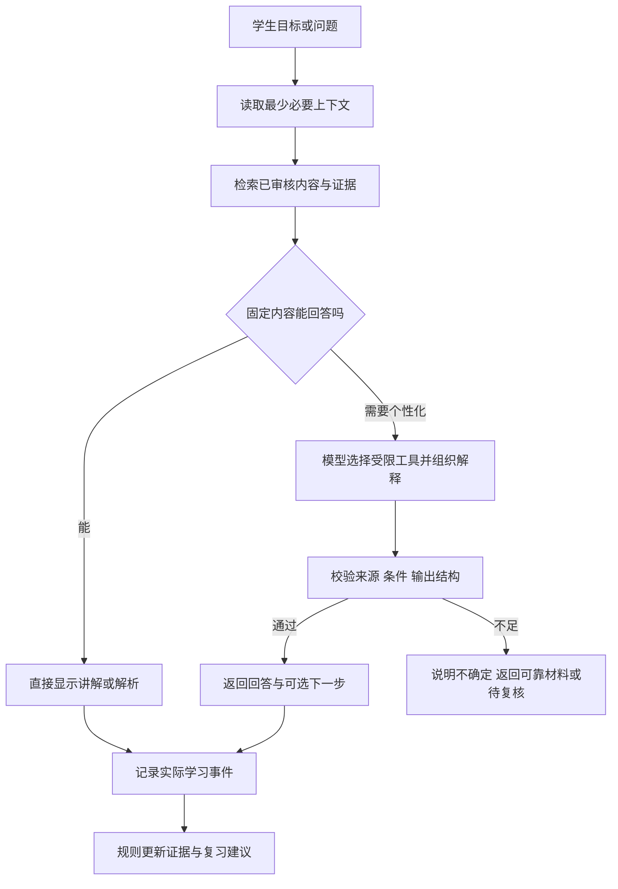
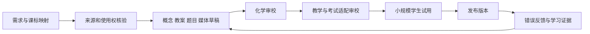
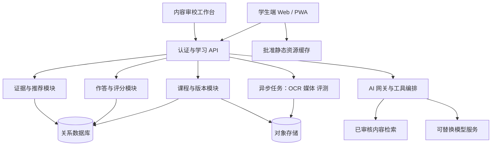

# 高中化学学习产品：完整设计 v1.0

**状态：完整方案，待产品评审与学生验证。**  
**日期：2026-09-25。**  
**适用目标：直接建设面向高中生的通用化学学习产品。**  
本设计覆盖高中化学的长期产品形态，首发以有限范围验证完整学习流程。这里的功能、服务指标、预算模型与时间安排均为设计提案；现有原型尚未实现本方案，也尚无证据证明其能提高高考成绩。

**学生体验补充：**[v1.1 逐屏流程、交互与内容设计](学生流程_交互与内容设计_v1.1.md)补充了实际课稿、页面状态、返回行为、优秀产品参考与可点击示范。v1.0 中概括性的学习旅程以该补充的具体交互为实施依据。

## 阅读导航

- 决策者：先读第 1、2、18、19、20 节，了解目标、取舍、投入和验收。
- 教学与内容团队：重点读第 3—11、14、17 节。
- 产品、设计与工程团队：重点读第 5、12—16、19、21 节。
- 第 22 节列出待确认事项与证据边界；第 23 节是研究来源；第 24 节回溯用户需求。

## 1. 产品要帮助学生完成什么

### 1.1 产品定义

一套贯穿高中化学学习的系统：以有依据的课程内容为基础，让学生能查清概念、看懂过程、完成练习、找出知识缺口、进行针对性补学，并通过间隔后的独立任务确认学习效果。

**核心承诺：帮助学生从“看懂讲解”走到“能独立解释、长期记住，并在新情境中解决问题”。**

日常语言可以概括为：**学得明白，记得准确，遇到新题有办法。**

### 1.2 学习目标的五个层次

| 层次 | 学生应能做到 | 系统用什么证据判断 |
| --- | --- | --- |
| 认识与表达 | 读懂物质名称、符号、单位、图表，准确说出定义 | 无提示提取、符号解释、概念辨析 |
| 解释与联系 | 在实验现象、粒子模型、方程式之间建立联系 | 解释题、图式对应、反例分析 |
| 方法与操作 | 配平、计算、设计对照、选择实验操作并说明理由 | 分步作答、实验决策、数据处理 |
| 迁移与论证 | 从陌生材料中提取信息，判断适用条件，形成证据链 | 未见题、条件变化题、开放实验题 |
| 保持与自我调节 | 一段时间后仍会用，知道自己哪些地方需要复习 | 延迟测验、预测与实际表现对照 |

好奇心、科学态度和负责任地理解生活中的化学也是目标，通过探究任务和作品观察，不能压成一个总分。

### 1.3 成功与边界

核心结果指标是**延迟、无提示的新题表现**，按知识主题、基础水平与地区分别报告。辅助观察学习用时、提示依赖、学生是否愿意继续以及教师诊断负担。课程看完率、聊天次数、停留时长属于使用指标，不能代替学习效果。

首发聚焦高中化学；架构为其他学科保留内容与评测接口，但暂不同时生产其他学科。产品支持学校教学和家庭自学，实验模拟不能替代真实实验中的操作训练。上线前不作保分、提分幅度或覆盖所有地区的承诺。

## 2. 用户、场景与价值主张

### 2.1 面向全体高中生，按当前任务而非永久能力标签分流

| 用户当前处境 | 要完成的事 | 首次体验应提供什么 |
| --- | --- | --- |
| 初高中衔接、基础有缺口 | 补齐当前课需要的初中概念 | 一个可跳过的短检查；只补必要先修 |
| 跟着学校学习 | 课前预习、课后弄懂一节 | 同教材目录、术语卡、原图讲解和三类练习 |
| 看懂解析但换题不会 | 找出思路缺口并迁移 | 对照题、条件变化、方法选择与解释 |
| 临近考试或刚考完 | 用有限时间修复最重要的薄弱环节 | 试卷对应知识点、错因假设、短补学路线 |
| 学有余力、好奇心强 | 探索为什么、挑战更复杂问题 | 实验探究、历史脉络、结构与原理深入阅读 |

同一个学生可以在不同主题处于不同状态。产品不根据一次测验贴“差生”“学霸”标签，也不按所谓固定学习风格给学生分型。

### 2.2 老师与家长的辅助角色

- 老师：布置经审核的学习单元，查看班级共性问题和证据，调整教学；可以更正系统归因。首发需要内容审校工作台，班级管理可以后置。
- 家长：看到投入是否适当、最近学会了什么、需要何种支持。默认提供摘要，不把学生每句对话和每次错误公开展示。
- 教研与编辑：维护科学事实、教材映射、题库来源、错误模式和内容版本，承担发布责任。

### 2.3 产品定位的取舍

采用“可系统学习的数字教材＋可操控实验＋有证据的练习反馈＋按需导师”的组合。完整讲解与独立练习均可使用，不把付费或 AI 连通作为理解核心知识的前提。长期竞争力来自经审校的化学内容、真实学习证据和持续改进的教学设计。

## 3. 教学依据如何落实

以下是研究启发与我们的产品决定；后者需要单独检验。

| 依据 | 对产品的启发 | 需要避免的推断 |
| --- | --- | --- |
| IES 学习指南支持分散学习、例题与解题交替、图文联系、提取练习及解释性问题，各建议证据等级不同 | 学习后安排提取和延迟复习；示范逐步减少；让学生有机会解释 | 不能由此断言固定 1/3/7 天适合每个人，也不能强制每题写长理由 |
| ACS 强调宏观、粒子、符号表征之间的联系 | 同一现象能切换观察、粒子图和方程式，并突出对应关系 | 三个复杂画面同时出现不一定更好 |
| PhET 研究与活动设计重视学生探索和适当引导 | 先预测、改变变量、观察、解释；允许自由试验与重置 | 能拖拽、会播放本身不等于学会 |
| 高中数学 AI 随机试验提示：练习有帮助与撤去 AI 后的学习结果可能不同 | 每次练习记录帮助程度，正式效果检验使用无 AI 任务 | 这项研究不能直接证明本产品或中国化学教学的效果 |

来源：[IES 教学与学习指南](https://ies.ed.gov/ncee/wwc/PracticeGuide/1)、[ACS 教学与评价](https://www.acs.org/education/policies/middle-and-high-school-chemistry/teaching-and-assessment.html)、[PhET 研究](https://phet.colorado.edu/en/research)、[Bastani 等，PNAS，2025](https://doi.org/10.1073/pnas.2422633122)。

美国教学研究提供可检验的方法；课程范围、表达深度和考试适配依据中国课程标准、实际教材及各地区要求。对命题思路的判断必须能指向题面证据或官方评析。

## 4. 全高中内容体系与教材适配

### 4.1 统一知识结构，多种进入顺序

长期内容按以下领域组织，具体年级和章节由教材映射决定：

| 领域 | 主要内容 | 必须贯穿的能力 |
| --- | --- | --- |
| 初高中桥梁 | 物质与元素、粒子、化学式、质量守恒、溶液、基本实验与数学基础 | 读符号、辨概念、用单位与比例 |
| 化学语言与定量 | 分类、离子反应、氧化还原、物质的量、浓度 | 表征转换、守恒、条件判断 |
| 元素及其化合物 | 典型元素性质、制备、检验、转化、用途 | 结构/价态/类别推性质，证据验证 |
| 化学反应原理 | 能量、速率、平衡、电化学、水溶液平衡 | 控制变量、图像与定量推理 |
| 物质结构与性质 | 原子、分子、相互作用、晶体等 | 用模型解释性质，识别模型边界 |
| 有机化学 | 结构、官能团、性质、转化、合成、分析 | 信息迁移、结构推断、路径设计 |
| 实验与科学探究 | 仪器、操作、制备、分离、检验、测量、误差 | 实验目的—原理—操作—证据—结论 |
| 综合应用 | 工艺流程、资源环境、材料、生活与健康信息辨析 | 多知识整合、评价方案、科学表达 |

知识目录与教材章节并存。按教材走时保留章节、节内关系图和复习页；按缺口补学时只提取相关内容，结束后返回原位置。

### 4.2 五张相互关联的图谱

1. **概念关系**：上下位、对比、同义名称、组成与性质等；不把所有边都叫“相关”。
2. **先修关系**：哪些知识是必需、哪些只是有帮助；必要先修保持可检查的有向无环关系。
3. **技能关系**：读图、配平、守恒、实验推理等可跨章节复用的方法。
4. **误解关系**：错误解释与可能缺口之间的连接，并保存反证任务。
5. **课程与考试映射**：概念/技能对应不同教材位置、课标要求、地区与届别。

学生主要看到整理好的关系图；后台保留细粒度结构。不要直接把数据库大图当学习界面。

### 4.3 版本与地区

首次只需选择年级、教材版本和当前进度，允许“暂不确定”；考试地区可稍后补充。记录 `standard_version / textbook_edition / region / exam_year / course_track`，映射无法确认时展示通用内容并标明适用范围。

**课标不能永久锁定在 2020 年版本。** 课程教材研究所已列出《普通高中化学课程标准日常修订版（2017 年版 2025 年修订）》解读。本次确认了修订版存在，但未逐条完成新旧条文与地区实施年级的差异审查。内容上线前需取得适用版本全文、核对当地实施通知，形成版本差异表。[课程教材研究所解读目录](https://www.ictr.edu.cn/Uploads/File/2025/12/01/2025%E5%B9%B412%E6%9C%88%E7%9B%AE%E5%BD%95.20251201190727.pdf)

每个新地区通过“要求核验—题型与评分核验—教师复核—样本试用”四步开通，不仅改变首页省份名称。按届别保留旧路径，升级不得悄悄改变学生所学范围。

后台兼容矩阵以“内容版本 × 课标条目 × 教材版次/位置 × 地区届别”为一行；状态为待核验、可共用、需修改、该路径不适用。每行保存核验来源、负责人和生效日期。例如同一概念的基础定义可能可共用，但例题深度和评分表达需要单独核验。未核验状态不能自动变成“支持该地区”；当前尚不填入任何未经确认的兼容结论。

## 5. 学生体验与界面结构

### 5.1 五个主要入口

| 入口 | 学生任务 | 结束时应得到什么 |
| --- | --- | --- |
| 继续学习 | 跟学校学一节 | 概念、例题、练习证据和下次复习建议 |
| 查概念 | 查一个词、符号或图 | 短解释、正反例、适用条件、返回原处 |
| 练与复习 | 针对当前薄弱项或临考复习 | 独立表现和下一步建议 |
| 看实验 | 看过程、试变量、回答为什么 | 可重放的观察与解释 |
| 试卷复盘 | 从一次考试找到值得补的内容 | 经核对的题目、错因假设、补学与复测路线 |

首页突出一个可修改的建议：“继续离子反应，约 12 分钟”，下方保留自由入口。时间估算来自内容时长和实际使用数据，允许随时暂停。学习记录展示具体能力和最近证据，避免倒计时焦虑和全班排名。

### 5.2 学习页

桌面：左侧目录可收起，中间主学习区，右侧按需打开术语/导师。手机：主内容单栏，目录和解释用可关闭的底部面板。主体包含：目标、原图或情境、逐步讲解、例题、练习、总结；屏幕一次突出一个主任务。

术语解释点击即可打开，支持键盘与触屏，不能只依赖鼠标悬停。弹层可再查一个前置词，但保留返回链；深度过大时建议打开知识卡，避免层层嵌套遮住课程。

### 5.3 三种自主学习方式

- **自主阅读**：完整材料与答案解析可访问，随时跳转。
- **引导学习**：按目标分步推荐，允许跳过预测、补课或提示。
- **独立检验**：学生主动开始后，暂不提供提示；退出检验即可查看帮助，记录为有辅助练习。

默认提供简洁引导，记住用户偏好。导师不强制开启；“给我提示”“换个例子”“直接讲解”平行可选。查看答案不会被训斥，也不会被记录成独立掌握。

### 5.4 四条端到端旅程

**同步学习**：选当前章节 → 看本节目标/关系图 → 可选先修检查 → 原图与例子 → 三类练习 → 显示已证实与待复测能力 → 预约复习。

**补一个缺口**：问“aq 是什么” → 一句话解释“水溶液状态” → HCl(g)/HCl(aq) 对照 → 可选一题 → 返回原句；不会把一个符号问题扩成整节强制课程。

**试卷复盘**：上传 → 自动遮去可识别身份信息并允许检查 → 确认题目/答案识别 → 聚合同类问题 → 学生选择优先修复项 → 短补学 → 新题验证 → 延迟复测。

**考前复习**：输入范围和可用时间 → 系统在范围内按近期证据与先修影响推荐 → 学生调整 → 提取关键规则、混合练习 → 对未覆盖项明示，不保证考前全部掌握。

## 6. 每个教学单元的制作协议

一个单元围绕一个可观察的目标，通常可拆为若干短活动；不为了规定分钟数打断必要推理。作者必须填齐以下内容，学生界面按需要展开。

| 组成 | 制作要求 |
| --- | --- |
| 学完能做什么 | 使用“判断、解释、写出、设计、评价”等动作，给验证任务 |
| 需要什么基础 | 列必要先修，提供短回顾与返回点 |
| 结构与原图 | 优先采用清晰且有使用权的原图；标示当前分支与分类标准 |
| 核心概念 | 定义、对象、条件、符号、日常词与科学词差别 |
| 正反例与边界 | 多个典型例、容易误判的反例、适用范围；选项类别必须互斥或注明多选 |
| 解释与示范 | 从可观察证据到模型再到符号，必要时给完整例题 |
| 记忆与检索 | 明确必背内容，给提取线索、易混对照与边界说明 |
| 三类练习 | 辨认、解释、迁移各有任务；必要时拆成多次完成 |
| 总结与关联 | 一个小关系图，一项方法，后续将如何用到 |
| 延迟检查 | 使用未见题或等价形式，避免重复熟悉原答案 |

### 6.1 给学生明确的四类标签

- **要记住**：定义关键条件、符号含义、常见物质及必要事实。说明要记到什么程度。
- **要理解**：为什么适用，什么条件变化后不能套用。
- **要会做**：能用哪些步骤解决什么问题。
- **想深入**：命名历史、扩展模型、生活专题；不默认纳入当前考试要求。

记忆任务举例：混合物由两种或两种以上物质组成；判断时看物质种类，不能用元素种类代替。要求学生能说出关键词并举正反例，不必统一逐字背诵所有解释段落。

### 6.2 术语卡的统一标准

每张卡有一句话解释、规范表述、读法/符号、至少两个正例与两个有针对性的反例、常见误解、所在关系图、需要时的命名故事与证据。不同难度层保持事实一致；教材简化与进一步解释之间给出过渡条件。

作者工具检查正文、题干、选项、图注中首次出现的学科词与符号是否能链接到解释；审核人处理自动识别遗漏与同名异义。像 aq、摩尔、酸根这样的符号或术语应纳入，普通日常词不机械加链接。概念解释里的前置词也必须可查。

内容模型明确保存 `representation_level`（初中桥梁/高中核心/进阶）、`assumptions`（简化假设）、`valid_conditions`（适用条件）和 `next_model`（何时引入更深入解释）。学段标签本身不能替代条件；同一学段的溶液与熔融情境仍需分别表达。简化允许省略暂时不必要的细节，不允许给出以后必须推翻的绝对断言。

示例：电解质卡要对照 NaCl 晶体/水溶液/熔融体、HCl 与盐酸、蔗糖、铜、水。说明类别判断对象与样品实际导电情况的区别；完整定义包含化合物在水溶液或熔融状态下自身产生可移动离子并导电的条件。铜导电不属于电解质；盐酸是混合物，HCl 是电解质；水是极弱的电解质，纯水导电很弱，“灯不亮”不等于绝对没有离子。发布前应由化学审校核对对应学段的措辞。

### 6.3 历史、生活与口诀

历史卡分别呈现“可核实的历史事实”“现代命名关系”“帮助记忆的联想”。例如硝石、硝酸、硝酸根的联系可帮助记忆，但不能把名称的历史解释成现代粒子理论已在古代形成。无法找到可靠来源的年代和人物不编造。

口诀固定四栏：口诀、对应规则、适用范围、反例。像“含 H 就是酸”“含 OH 就是碱”“所有含碳物质都是有机物”不能成为独立判据。酸式盐、醇、碳酸盐等边界用来检查规则是否真的理解。

生活专题需回到化学问题。电解质饮料可连接离子、标签成分、糖与盐；不要把“导电更强”解释为“更健康”。涉及运动补液的建议需另用可靠健康来源审核，课程不提供个体医疗建议。

## 7. 三题学习结构与高考训练

### 7.1 三道题承担三种作用

| 题的角色 | 学生在练什么 | 反馈必须指出什么 |
| --- | --- | --- |
| 第 1 题：规则辨认 | 定义、条件、对象 | 考点、要记住的原句/关键词、一个反例 |
| 第 2 题：解释与辨析 | 为什么、错误在哪 | 推理链、干扰项为什么诱人、如何排除 |
| 第 3 题：条件变化与迁移 | 换物质、换图、换问法后选方法 | 保持不变的原理、改变的条件、适用边界 |

保留每部分“三题”的清晰入口，但题库需要备选题、诊断题与延迟题。同一个学生已经有充分证据时可以少做；基础缺口较大时推荐一个小补学，而不是无限加题。必须需要真实考试能力的部分，可分层引入综合题，初学概念时可用已明确标为原创的准备题。

每道题答后都展示：**考什么 → 要记什么 → 怎么判断 → 这次错法可能说明什么 → 换个条件试试**。错误解释先是“可能”，只有追加证据支持后才形成诊断。

### 7.2 真题、改编与原创的来源制度

| 类型 | 必备来源信息 | 面向学生的标签 |
| --- | --- | --- |
| 已核验真题 | 年份、地区、卷别/考试名称、题号、原卷定位、来源与使用权、答案依据 | 真题，并可查看来源 |
| 改编题 | 母题标识、具体改动、重新审校结果、权利范围 | 改编，明确不是原题原文 |
| 原创题 | 作者/生成记录、目标能力、审核与答案版本 | 原创训练；可关联考法依据 |
| 学生个人试卷 | 原图区域、OCR 版本、来源自述、识别确认状态 | 个人试卷，不自动公开入库 |

只有考试评析链接、没有原卷与题号核验时，只能声称“参考某考法”。暂时找不到适合的已核验真题，就明确缺口，使用原创题完成教学，不能补写一个虚构来源。

### 7.3 如何研究命题，而非只贴“高考重点”

每个重点建立“题族分析卡”：

1. 题面要求的可观察能力；主考点、辅助知识与先修分别标注。
2. 已知信息、隐藏在措辞中的条件、需要自行调用的知识。
3. 最短合理解题链、可接受的另一条路线。
4. 每个干扰项对应的错误假设；不能仅因选了某项就断定错因。
5. 改变哪些条件仍用同一方法；哪些改变会让答案反转。
6. 主观题评分点、等价表述、关键化学证据。
7. 不同年份、地区如何考查同一能力；未经过完整统计不称“最高频”。

浙江 2025 年评析强调基础、综合和新情境；2026 年 1 月评析进一步以具体题目说明信息加工、迁移、实验证据与论证的考查。因此训练应覆盖“从材料获取信息—选择模型—论证结论”，同时保留定义和基本用语训练。这是基于公开评析的教学判断，不能代替全部地区的命题研究。[2025 浙江评析](https://www.zjzs.net/art/2025/6/11/art_31_11279.html)、[2026 年 1 月浙江评析](https://www.zjzs.net/art/2026/1/9/art_31_11861.html)

### 7.4 题库覆盖矩阵

后台按“主题 × 技能 × 难度 × 表征 × 情境熟悉度 × 来源 × 地区/版本”检查覆盖，不强求所有组合都有题。先覆盖必须学习的能力，再优化分布。保留独立测评题族；同一道母题的数字变式不能一部分进教学、一部分冒充未见测评。

## 8. 完整教学样例：物质分类

本节全部题目是**本设计原创示例**，用于展示教学协议，不作为已核验高考真题。

### 8.1 目标与原图

目标：学生能判断纯净物与混合物，说明判据，并在物质种类和元素种类不同的情境下保持正确判断。

先打开有权使用的原始分类树，显示完整图，再逐步高亮“物质 → 纯净物/混合物”。学生点分支时看到分类依据与示例；原图始终可查看，不用重新排列成宽到溢出的卡片。随后才进入“纯净物 → 单质/化合物”。

### 8.2 先修回顾

可选检查：“一种物质能否由两种元素组成？”若不确定，用 H₂O 的组成说明物质、元素、分子是不同层面的概念。初学时从水分子解释，但不能推广为“所有纯净物都由分子构成”；NaCl 等另提供粒子结构入口。

### 8.3 明确教给学生的内容

- 要记住：混合物由两种或两种以上物质组成；纯净物由一种物质组成。
- 要理解：物质的种类与元素的种类是两个分类维度。
- 要会做：读清样品 → 列出组成物质 → 数物质种类 → 纯净物再看组成元素。
- 记忆提示：**先数物质，再看元素。** 适用对象是物质分类；不能直接用溶液中粒子种类数来替代组成物质的判断。

### 8.4 三题与反馈

**题 1 · 定义辨认**：一杯样品只含 H₂O，因含 H、O 两种元素，所以是混合物。对还是错？

答案：错。考点是纯净物/混合物的分类判据。要记住“物质种类”；样品只有一种物质。反馈给出错误来源“可能把元素种类当作物质种类”，并提供“只含 CO₂ 的样品”作可选短迁移。

**题 2 · 反例辨析**：O₂ 与 O₃ 混合，只含氧元素，属于纯净物。对还是错？

答案：错。考点是同一种元素可以形成不同单质。O₂ 与 O₃ 是两种物质。与题 1 对照，形成二乘二思考：一种/多种元素并不能单独决定纯净物/混合物。附上 O₃ 名称与含义的可查卡片，避免默认学生已认识。

**题 3 · 表征迁移**：甲瓶标注纯氯化氢 HCl(g)，乙瓶标注盐酸 HCl(aq)。两瓶是否都因标签写有 HCl 而属于纯净物？

答案：不是。题设甲是纯 HCl；乙是 HCl 的水溶液，属于混合物。考点是名称、状态标记与表示对象。先解释 g 和 aq，明确“盐酸”这个名称本身指溶液。由此迁移到纯硫酸与稀硫酸；仅写“硫酸”且上下文不清时，应先确认指物质还是试剂溶液。

### 8.5 证据与下一步

题 1 对、题 2 错：建议看“元素相同不等于物质相同”对照；题 3 错但前两题对：优先补名称和 aq，不把学生判成完全不懂分类。若三题都对，记录“本次辨析通过”，以后用未见样品与短解释复测；不直接显示“100% 掌握”。

高级边界可折叠：纯水存在极少量离子，不因此按粒子种类把纯水判成混合物。该边界应在学习电离时再连接回来，避免首次分类课负担过重。

## 9. 动画、原图、视频与虚拟实验

### 9.1 按教学问题选媒体

| 学习问题 | 首选形式 | 验收重点 |
| --- | --- | --- |
| 结构和类别关系 | 优秀原图＋分支高亮＋可查例子 | 全图可见、关系准确、解释不遮挡 |
| 随时间发生的微观过程 | 可暂停、可回放的过程动画 | 每个变化对应明确机制 |
| 改变变量会怎样 | 可操控模拟 | 参数改变影响现象，条件与边界可见 |
| 实验手法和真实现象 | 经审校的实拍短视频 | 装置、动作、现象可信，字幕与关键帧齐全 |
| 综合复习与记忆 | 静态对照卡、时间线、短讲解 | 能快速提取重点，支持打印 |

生成式视频可以辅助分镜与非事实性场景制作；涉及颜色、装置、粒子变化和反应机理时逐帧审校。关键化学仿真使用可测试的状态与规则。素材中用放大或颜色编码表示的粒子必须标“示意”，不能让学生以为是显微镜实拍。

### 9.2 三个优先制作的模拟

**A. 导电从哪里来。**

选择 NaCl 晶体、NaCl 水溶液、蔗糖水溶液、纯水和铜；先预测，再连接虚拟电路。观察层展示定性导电差别；粒子层区别离子被束缚、离子定向迁移与金属电子导电；符号层联动电离式。纯水用适当量程展示极弱导电，避免灯泡模型给出绝对不导电的结论。蔗糖明确化学式和分子溶解的示意。模拟不提供没有温度、浓度等条件支持的精确电流数值。

**B. 为什么产生沉淀。**

在给定常见实验浓度的水溶液中混合 BaCl₂ 与 Na₂SO₄，观察溶液中离子及 BaSO₄ 固相形成；突出旁观离子仍留在溶液中。切换 NaCl 与 KNO₃ 作对照。先查相应溶解性事实，解释“难溶”是一定条件下溶解能力很小，不能说任何数量的离子相遇都必然出现肉眼沉淀。进阶模块再引入离子积与溶度积，不要求初学者一次掌握。

**C. 配制溶液的误差。**

用同一目标浓度比较正确操作、定容超线、转移损失等单变量情境。显示溶质的物质的量与最终体积如何变化，连接 c=n/V；提供真实操作视频与虚拟对照。先限定其他条件相同，不能把多个误差混在一起还给唯一方向。

### 9.3 媒体共用标准

所有动画有暂停、单步、重放、速度控制、文字说明、静态关键帧与减少动态选项。粒子以颜色加形状/符号区分；字幕可独立阅读，公式有可访问文本。手机不依赖精细拖动，低网速可读静态版本。

评估时比较相同内容的静态版和模拟版是否改善解释与迁移，记录观看耗时。先试导电和沉淀，再决定是否扩大；不按动画数量评估质量。

## 10. 学习证据、诊断与推荐

### 10.1 记录可观察事实

每次作答保存题目与内容版本、首次答案、修改轨迹、提示/解析是否已看、作答模式、时间、评分及评分依据。学生自评把握程度可选，不能替代实际证据；长时间停留可能是离开屏幕，不能自动归因为理解困难。

一次综合题可关联多个技能，但每个评分步骤只向有依据的技能提供证据。答错总题不等于所有相关知识都不会。

### 10.2 学习状态

按知识点和能力维度分别记录：**尚无证据 → 正在理解 → 在帮助下完成 → 独立完成 → 延迟仍能完成**。出现矛盾证据时显示“需要再确认”；状态可更新，也能解释为什么变化。

示例：“你已独立完成两种不同情境的分类判断；还没有延迟复测证据。”比精确到小数的掌握百分数更适合冷启动。

初期以透明规则推荐；获得足够数据、经过校准和分组检验后，再考虑概率掌握模型。学生界面始终显示证据数量、时间和范围，不把模型估计包装成考试预测。

能力维度分别存放，允许出现“定义提取稳定、条件判断待确认、迁移尚无证据”的组合。题型熟练不能自动提升迁移状态；偶然完成一道难题也不能抹去基础知识中的矛盾证据。

### 10.2a 证据质量与状态更新契约

证据质量使用多维标记：应用内帮助、同题/题族暴露、任务对应能力、评分可信度、识别确认情况、距学习时间及完整性，不用一个笼统的高/低分代替。

| 观察 | 能支持的判断 | 不允许的自动推断 |
| --- | --- | --- |
| 看完答案后做对原题 | 能跟随或再现刚才的方法 | 独立完成、未见迁移 |
| 未看帮助，做对重复原题 | 对该题的独立再现 | 新情境迁移 |
| 未见题族、无应用内帮助、量规评分可靠 | 对该任务所测能力的独立证据 | 所有相关知识都已掌握 |
| 正确解释，但内容来自复制或已展示的解析 | 已完成解释活动，独立性不明 | 因为是解释题就认定高质量掌握 |
| 延迟任务完成、条件和评分可靠 | 指定时间与任务范围的保持证据 | 永久不会忘记 |
| OCR 未确认或评分争议未解决 | 待核验记录 | 更新正确率或降低学习状态 |

初期规则：只在对应能力维度汇总有效证据；有辅助证据不升级独立状态；未确认识别/评分不参与升级；重复原题不贡献新情境迁移；延迟状态必须来自实际延迟任务。证据冲突时保留双方并安排可选区分任务。每次状态变化能追溯到具体事件和规则版本，规则升级后可重算。

### 10.3 错因是待检验假设

候选类别：术语/符号不明、事实未记牢、分类对象混淆、条件遗漏、表征转换困难、方法选择不当、运算/单位问题、实验逻辑不足、题干识别错误。

例如“认为 NaCl 晶体不是电解质”可能来自定义记错，也可能来自把样品导电和物质类别混为一谈。推荐一组对照或追问作区分；两次证据仍不清楚则标记未知，允许学生说“我只是看错了”。一次选择不足以做心理或能力诊断。

### 10.4 推荐规则与停止条件

先过滤教材范围、可用时间、先修要求、内容质量、既往题目暴露；再综合当前目标、近期缺口、到期复习和内容多样性排序。给出一句可读理由，允许换任务、推迟或关闭推荐。

初始策略提案：连续两次受阻就推荐一个先修回顾或换表征；已经在两个不同情境中无提示完成后，可结束本轮并安排延迟任务。这是可调整的产品规则，不能当作学习定律或强制通关条件。复习间隔由实际回忆表现、目标日期和负担调整。

## 11. 试卷诊断流程

1. 上传图片/PDF，检查页序、缺页、裁切、清晰度；区分打印题目、学生笔迹与批改痕迹。
2. OCR 保留原图坐标；化学式上下标、负号、箭头、单位等不确定处高亮。用户可点原图更正，不静默补造缺字。
3. 标准答案优先用核验来源。没有可靠答案时输出待审解析，不给确定总分；红笔不是默认标准答案。
4. 把每道题拆为可评分步骤与知识证据；显示“已确认/待确认”，聚合同类缺口。
5. 推荐有限的补学任务，标出“这道题的哪一步对应这里”；学生可以只复盘一题。
6. 使用不同表面情境的新题复测，之后进行延迟检查。

个人试卷保存在个人空间，不未经授权进入公共题库或模型训练。OCR 不能识别时允许手工录入；服务失败不丢原图与修改记录。原图和高精度识别结果按明确保留期处理，删除时同时清理衍生数据与检索索引。

## 12. Agentic 系统：职责、工具与自主权

### 12.1 什么行动由系统主动完成

学生选择目标后，系统可以检索学习证据、查先修、选一项合适内容、生成有依据的解释、安排待确认的复习建议，再根据新作答修正建议。每个行动有范围、证据、工具结果和停止条件。

一次学习中不必启动多个模型互相讨论。逻辑上分为以下职责，可由一个编排服务按需调用：

| 职责 | 输入与工具 | 输出及约束 |
| --- | --- | --- |
| 学习规划 | 当前目标、有效证据、课标映射、批准内容 | 有理由的短任务列表；学生可更改 |
| 解释与导师 | 当前页面、题目、已审核解析、学生具体问题 | 分层提示/直接解释/对照例；给依据 |
| 诊断建议 | 首次作答、过程、已用帮助、追加任务 | 错因假设和置信边界；不直接写“已掌握” |
| 试卷助手 | OCR、原图、答案与题库检索 | 待确认题目与关联；低把握项转人工 |
| 内容制作助手 | 来源、目标、模板 | 草稿、候选变式、分镜；必须审校发布 |
| 质量检查 | 化学规则、来源、评分样例、模型输出 | 拦截、提示复核、记录版本 |

### 12.2 在线调用流程



工具只允许获取批准内容、检索题目、读取本人学习证据、检查守恒/单位、请求白名单模拟状态、提出推荐。学习证据由实际作答与受控评分流程写入；模型不能自行修改权利信息、标准答案、成绩或跨用户数据。

化学规则可检查原子与电荷守恒、单位等有限性质；**配平正确不意味着反应真实可发生**。反应条件、溶解性、开放解释必须结合已审核知识与必要人工判断，不能设计一个声称通晓所有化学的自动裁判。

### 12.3 延迟、失败与费用约束

首发提案：一次导师交互最多 3 次工具调用、1 次格式修复重试，20 秒给出完成结果或明确降级；超时返回固定解析与重试入口，取消请求立即停止后续调用。复杂试卷转为后台任务，显示阶段并可取消。具体阈值需实测校准。

小模型用于分类/检索重排等经评测任务；高要求推理才升级。固定内容优先、版本化缓存、只发送当前相关证据、限制上下文长度、记录每次调用成本。缓存不得跨用户泄漏试卷或对话。

### 12.4 研发协作与运行服务

继续使用现有 Codex with ChatGPT 做设计、教案草稿及复核，节省研发期间的重复推理成本。Minimax、agy 等现有连接可作为原型实验入口。面向多用户的正式运行通过可替换的服务端模型适配器接入受支持服务，并核验当时条款、价格和数据处理方式；不能把本机浏览器登录或个人订阅会话当作通用产品的稳定后端。

模型选择依据同一化学评测集的正确性、可控性、延迟、成本和数据政策；本设计不预先绑定某品牌或承诺订阅能覆盖商业运行。

## 13. 数据模型与接口契约

### 13.1 核心实体

| 实体 | 关键字段/关系 | 设计原因 |
| --- | --- | --- |
| Concept / Skill | 稳定 ID、定义、边界、先修、误解、表征层级、简化假设、适用条件 | 同一知识跨教材复用 |
| Claim / Source | 事实陈述、适用条件、来源定位、核验日期、审核人 | 解释可追溯到具体事实 |
| CurriculumMapping | 课标版本、教材版次、章节、地区/届别、要求程度 | 支持通用产品的不同路径 |
| Lesson / Activity | 目标、活动序列、资源引用、可选分支、版本 | 课程由模块组成，按需补学 |
| Item / ItemFamily | 题干、选项、答案、评分量规、题族、知识映射、来源类型、审核状态 | 区分原创/真题，防止测评泄漏 |
| Asset / SimulationSpec | 原图、视频、字幕、模拟状态规则、来源、使用权、替代文本 | 媒体是可审校的教学对象 |
| Attempt / Evidence | 用户、题目版本、首次与后续作答、帮助/暴露情况、评分版本、识别确认、证据范围 | 可回看为什么作出判断 |
| LearnerState / Recommendation | 各能力状态、证据引用、待确认项、推荐理由、规则版本 | 状态可解释、可重新计算 |
| ExamImport | 原图、识别结果、坐标、纠错、答案来源、删除时间 | 识别不确定性可管理 |
| Review / Release | 作者、各项审核、版本、差异、发布时间、撤回原因 | 内容发布与回滚有记录 |

概念 ID 跨版本稳定，定义变更产生新版本。题目错误修正后，旧作答保留原始评分并记录更正结果；受影响的学习状态重新计算、通知用户具体影响。不能静默覆盖历史。

### 13.2 一条学习事件的示例

以下是数据契约示例，不是当前系统已有 API：

```json
{
  "event_id": "unique-id",
  "type": "attempt_submitted",
  "learner_id": "pseudonymous-id",
  "session_id": "session-id",
  "item_id": "classification-transfer-003",
  "item_version": 2,
  "attempt_number": 1,
  "mode": "practice",
  "answer": {"choice": "B"},
  "assistance": {"hints_seen": [], "solution_seen": false},
  "occurred_at": "2026-09-25T08:00:00Z"
}
```

评分由服务端绑定版本计算，客户端不能提交任意“已掌握”。事件 ID 用于重复提交去重；服务器另记接收时间，离线时钟异常不产生虚假学习时长。客户端自述的无提示只表示“应用内未使用帮助”，不能保证现实中绝无外部辅助。

### 13.3 首发接口边界

| 接口/服务 | 合同与失败处理 |
| --- | --- |
| 获取课程与内容 | 传入课程版本；返回批准内容及媒体权限，找不到时清晰显示范围缺口 |
| 提交作答 | 幂等键＋题目版本；返回评分依据、证据贡献及可选下一步 |
| 获取推荐 | 包含目标、范围、可用时间；返回理由、替代选项与规则版本 |
| 导师请求/取消 | 携带当前活动 ID 与最少上下文；可取消、流式反馈、成本封顶 |
| 试卷导入/确认 | 异步任务；低置信字段先确认，失败可续传或手工输入 |
| 内容发布/撤回 | 必须通过审核与权限检查；发布批次可回滚 |
| 导出/删除学习数据 | 显示进度与保留例外；传播到附件、索引、缓存及处理方 |

客户端、模型返回和外部文档都作为不可信输入验证。上传的题干中出现“忽略规则”等文字时，只能作为题目数据处理。

## 14. 内容生产与质量工作台

### 14.1 发布流水线



题库不是一次批量生成完就交付。作者工作台应能同时预览学生界面、来源、知识映射、答案与反例，检索重复题，检查上下标与符号、关系图溢出和媒体字幕，查看试用中反复出现的误解。

### 14.2 人与 AI 的分工

- 教研负责人定义目标、必学范围、题族和判断标准。
- AI 辅助查漏、生成候选例子/变式/讲解、制作分镜，结果始终是草稿。
- 化学审校核验定义、条件、方程式、溶解性、现象与边界。
- 教学审校检查先修、信息负担、推理顺序、正反例与迁移是否真实。
- 考试审校核验原题、地区适配、评分点及标签；授权与个人数据审核单独记录。
- 产品/工程检查交互、可访问性、性能、事件和版本一致性。

关键结论和高影响评分由非原作者复核。早期小团队可兼任角色，但不能让同一次 AI 自检冒充独立审校。

### 14.3 一份内容的完成标准

发布对象具有：明确目标和条件、先修入口、正文与原图来源、正反例、三种练习角色、固定答案/量规、错误路径、延迟检验、使用权记录、审核记录、手机/无障碍检查、有效事件记录。未满足的内容可保留草稿或标“试用”，不得伪装成成熟已审内容。

系统检查必填字段、死链接、公式规范、原子/电荷守恒等可计算项目；人审负责学科与教学实质。两者都通过也只说明发布质量门槛通过，不说明学习效果已经验证。

### 14.4 纠错与更新

学生可在任何题目报告“有疑问”，附内容版本。严重事实/答案错误先停止分发相关对象，提供已审核替代内容；核对后更正评分与受影响推荐。来源失效时保留已有权利允许的核验记录，重新寻找可靠依据；权利撤销时下线受影响素材。每学期和考试要求更新时复查课程映射。

## 15. 技术架构与演进

### 15.1 首发采用模块化单体

建议响应式 Web/PWA，适配手机、平板与桌面；客户端负责界面、离线资源和模拟。服务端把课程、作答、推荐、AI、媒体处理、管理工具分为明确模块，先以同一应用部署，避免早期分布式运维负担。



技术基线提案：TypeScript 前后端、React 类组件体系、PostgreSQL、对象存储、任务队列；具体框架/云服务在技术验证时按团队技能、部署地区与成本锁定。先使用关系表表达概念及边，不因“知识图谱”三个字立即引入专用图数据库。检索优先标签与全文，语义检索作为补充。标准公式使用受控数学排版，禁止把模型任意 HTML 直接执行。

只有出现明确瓶颈后，再将媒体处理、OCR、模型网关等独立扩容。日常学习路径不依赖每次 AI 调用成功。

### 15.2 存储与同步

课程与媒体可缓存；个人试卷默认不进入公用缓存。学生离线可以阅读已下载内容与作答，联网后按事件同步；冲突合并保留原始事件，以服务端课程版本/评分为准。离线评分先标暂存，避免与正式结果混淆。多设备恢复到同一内容版本和最近位置。

备份、恢复演练、发布回滚、内容撤回、模型熔断和成本告警应在公开试用前具备。内容包与代码分开版本化，可以修订教案而不重新发布整个应用。

### 15.3 首发工程验收目标（待实测调整）

| 项目 | 建议门槛 | 测量方式 |
| --- | --- | --- |
| 常用页面可操作 | 约定中端手机/网络条件下 P95 ≤3 秒 | 固定设备与网络基线，不用开发机替代 |
| 普通作答提交 | P95 ≤1 秒获得结果；网络异常可重试不重复记账 | 并发与断网测试 |
| 导师 | 20 秒内完成或给可靠降级；可取消 | 按供应商、题型统计分位数 |
| 可靠性 | 试用目标月可用性 99.5%，明确排除范围 | 外部探测＋错误日志；不是已达成 SLA |
| 内容与权限 | 已发布对象均有版本和必要来源；跨用户读取测试全通过 | 自动门禁与人工抽检 |
| 可访问性 | 关键路径键盘可用、字幕/替代文本完整、手机无横向截断 | 真实设备和辅助技术检查 |

先用试点人数推导并发预算，再做对应负载测试；不在没有用户量依据时设计百万并发系统。

## 16. 数据边界、安全与可访问性

这些是产品上线要求，具体法律适用与商业运营资质由部署地区的专业审核确认，本文件不构成合规认证。

- 面向包含未成年人的群体：只收集学习必需的数据；年龄/监护同意和学校使用流程按适用要求设计。手机号、学校、班级、真实姓名不应成为阅读基础课程的默认门槛。
- 每个角色采用最小权限；老师仅访问授权班级与必要证据，家长关系需确认。明确到期、解除关系和毕业后的数据处置。
- 个人试卷上传前后尽量去标识；选择模型服务时核验训练使用、保留时间、地区和删除机制。学生数据不默认用于训练，不在调试日志打印整张试卷或整段私人对话。
- 原图、音视频、真题和教材需有可核验的使用权；“网上能找到”及“用户提供”都不等于通用产品可公开分发。授权不足时保留来源索引或制作独立教学素材。
- 上传附件限制类型与大小，安全解析；外链与上传文本不能获得工具权限。接口鉴权和租户隔离必须在服务器执行。
- 模拟和实验视频标清适用条件，涉及危险试剂/装置的内容经过实验安全审校，不能把虚拟操作自动转成在家复现实验指引。
- 学习界面无惩罚式连续打卡、羞辱文案和默认公开排名。错误是学习信息，学生能暂停、查看解释、更正资料和导出/删除数据。
- 文字大小可调，关键关系不只靠颜色；屏幕阅读器能读公式含义；动画有静态替代，视频有字幕与文字摘要。

## 17. 怎样证明系统有用

### 17.1 四层验证

| 层次 | 回答的问题 | 方法 |
| --- | --- | --- |
| 内容正确 | 有没有科学错误、无来源真题或误导性简化 | 化学教师审校、题源核对、固定回归样例 |
| 产品可用 | 学生能否找到并完成任务 | 观察式可用性试验、真实设备检查 |
| 诊断与 AI 可靠 | 判断有无证据、解释是否正确、低把握是否会停 | 双人标注评测集、分组误差、失败注入 |
| 学习有效 | 撤去帮助后是否学会并保持 | 前测、即时无提示后测、延迟测试、未见迁移题 |

### 17.2 教学试验提案

**第一步：发现问题。** 招募约 12—18 名不同基础的学生做观察式试用，覆盖手机和电脑；目的是发现读不懂、被迫绕路、识别失败等问题，不用这个样本宣称提高成绩。

**第二步：小范围可行性试点。** 约 40—60 名学生、若干班级完成指定主题的学习与一周后复测，检验招募、使用、缺失数据、内容难度和评分量规。人数是执行估算，不构成统计功效保证。

**第三步：效果试验。** 在掌握基线方差、班级相关性和流失率后预先设定样本量。比较等内容、近似等学习时长的普通数字讲解/练习与本系统；按学生或班级随机分配时处理串组与聚类。预先确定主要指标、最小有教育意义的差异、分析方法和退出流程。

主指标为约一周后无 AI、无提示的未见任务成绩，可增加更长间隔；同时检验即时后测、迁移、解释、时间和学习负担。训练题与测评题按题族隔离；条件允许时评分者不知组别。报告基线、效应区间、缺失和分组结果，不只展示最有利的平均提升。

动画、导师、推荐分别试验，避免一个版本同时改变所有因素却无法知道哪些有用。若仅提高完成率但独立表现没有改善，优先修教学流程而非扩大内容生产。

### 17.3 AI 与诊断评测集

覆盖正常提问、模糊题意、术语冲突、错题诱导、OCR 上下标丢失、虚构来源、跨用户请求、答案已看、常见反例、条件不足、模型超时等。每次模型/提示词/检索/规则升级运行相同基线，并补入真实失败案例。

首发建议准备不少于 200 个有教师标注的核心案例，按主题和风险分层；规模并不保证覆盖充分。高风险答案错误、泄露个人数据、伪造真题来源的基线失败必须修复后发布。普通解释的合格比例和诊断一致性阈值在标注试点后冻结，报告分母及区间，不能用少量全对说明系统永远正确。

### 17.4 指标字典

- 独立正确率：应用内未见提示/解析的首次有效作答正确数 ÷ 同类有效作答数；注明无法排除外部帮助。
- 延迟表现：指定时间窗内、指定范围的无提示任务得分；未参加人数单列，不默认计为掌握或删除。
- 迁移表现：教学未暴露题族/情境中的量规得分；区分近迁移和综合迁移。
- 提示依赖：使用提示的活动占比及后续独立表现，不能单纯要求越低越好。
- 诊断可行动性：教师确认推荐能针对已观察缺口的比例，辅以学生反馈。
- 成本效率：每有效学习任务、每周活跃学生和每个经验证的学习目标改善的成本；学习收益不足时不凭低调用费宣布成功。

## 18. 成本与商业路径

### 18.1 主要投入

早期关键投入是化学教研、题源与使用权整理、独立审校、模拟制作和学生试验。模型调用是可管理的运行成本之一。批量生成大量题目会增加审校与维护工作，应核算完整成本。

**月运行成本模型：**

`固定基础设施 + 内容维护人力 + 活跃人数 ×（人均导师调用数 × 单次综合成本 + 人均OCR页数 × 单页成本 + 媒体/存储/客服成本）`

单次综合模型成本含输入/输出、重试、工具与高阶模型升级。将各供应商实际账单与内容版本记录关联，价格到选型时再核验。

敏感性示例（纯假设，不是报价）：1,000 名月活学生，每人 20 次导师请求，单次综合成本 0.02/0.10/0.50 元，对应模型费用 400/2,000/10,000 元/月；尚未包含 OCR、媒体、教研和基础设施。应同时检验调用量翻倍、重复请求、失败重试与免费用户占比。

### 18.2 控制成本的方法

固定讲解、已审解析和共性问答尽量复用；个性化处理只针对当前缺口。模拟与视频先做高价值主题，采用可复用组件。作者工作台统一模板与来源引用，减少重复编辑。现有 ChatGPT 协作继续用于研发规划和复核；是否便宜以实际使用记录判断。

设课程、学生和供应商三个层级的可观察预算，接近上限时先降级到可用固定内容、暂停非必要后台生成；不能悄悄降低评分质量。学生界面展示可理解的 AI 使用额度，核心课程与历史记录仍可访问。

### 18.3 收费与推广假设

建议先验证家庭直接使用：免费体验若干完整单元与基础词典，付费提供完整课程路径、试卷复盘、复习计划及合理 AI 额度。教师版在班级诊断与内容管理确有需求后推出。最终定价由使用成本、授权成本、试用反馈和付费意愿决定，不在研究前指定价格。

试点优先通过合作化学教师招募多种基础学生，避免只找创始团队熟悉的学生。关注学生是否主动回到有效任务、家长是否理解学习报告、教师是否愿意继续使用，而不是强制使用产生的留存。

商业推出前核验所在地对相关教育服务、未成年人收费、内容许可和数据处理的要求。若价格只能覆盖模型调用却无法支持教研与审校，则商业模型仍不成立。

## 19. 实现路线与阶段验收

### 19.1 团队与估算前提

下面的周期是规划区间，不是交付承诺。假设小团队具备产品/教学负责人、2 名工程人员、交互/媒体设计能力，以及至少 2 名可交叉审校的化学教师；研究与内容人员可兼职但需明确投入。仅由单人兼任时应缩小范围或延长周期。

| 阶段 | 建议区间 | 核心交付 | 进入下一阶段的门槛 |
| --- | --- | --- | --- |
| P0 目标与基线 | 2—3 周 | 课标/地区版本核对、学生访谈、指标、内容模型、授权清单、原型故事板 | 范围与证据要求明确；关键素材能合法使用；教师认可目标 |
| P1 完整学习闭环 | 4—6 周 | 10—15 个概念、4 个完整单元、题族与复测、2 个可操控模拟、可选导师、最小作者审校台 | 独立作答、辅助作答与延迟表现可区分；所有内容审核；核心流程与失败恢复可用 |
| P2 小范围学生试点 | 4—6 周 | 可用性修复、试卷导入试用、延迟复测数据、诊断与成本报告 | 无关键科学/隐私问题；招募与复测可执行；确定效果试验方案 |
| P3 可售基础课程 | 8—12 周，按实测产能调整 | 选定教材的一个完整学期/模块、支付权益、可靠性、客服和内容维护 | 学习价值与成本均有可支持证据；许可和服务要求核验通过 |
| P4 全高中与地区扩展 | 按覆盖矩阵分批估算 | 后续必修与选择性必修、综合考试能力、更多教材地区、教师班级工具 | 每批通过内容覆盖、地区审校、学习验证和运营门槛 |

首发人教版及一个明确考试地区是建议的启动配置，最终地区在 P0 根据试点条件选择。通用产品目标要求数据与课程映射可扩展，首发质量通过后才逐步覆盖更多人群。P1 可优先选分类、导电、离子反应、氧化还原，理由是先修联系强、原型已暴露典型问题；若 P0 访谈显示其他主题更有价值，可调整。

### 19.2 P1 必须完成与后置项

**必须完成**：按教材进入、先修回顾、规范概念卡、原图讲解、三类练习、独立/辅助证据、可关闭导师、延迟复测、内容审校、来源标识、跨用户隔离、异常降级、基本手机体验。

**后置**：全高中一次覆盖、实时语音数字人、复杂 3D 实验室、自动预测高考分数、完整学校管理、跨学科拓展。新增能力要说明改善哪个学习瓶颈和如何验证。

### 19.3 停止、调整和扩展条件

- 发现关键化学错误或数据越权：停止分发受影响功能，修复后复测。
- 诊断频繁错归因：回到可观察证据和可选推荐，减少自动路径调整。
- 学生被流程劝退：缩短步骤、提供自主阅读与直接解释，重新观察。
- 导师改善练习却增加独立检验失败：减少代答，改善帮助选择与后续检验。
- 媒体昂贵但没有改善解释/迁移：优先完善静态图与例题。
- 试点学习数据不足：继续收集并说明不足；不把无显著差异解释为已经等效。
- 只有当质量、效果与成本均有依据时扩大内容和用户规模。

## 20. 现有原型如何成为新产品的资产

| 已有资产 | 处理方式 |
| --- | --- |
| 用户反馈和试卷案例 | 提炼成需求、误解案例与回归检查；个人信息保持私有 |
| 概念解释、原创建模题和解析 | 按新模板审核后入库，保留出处与版本；不因已有就自动合格 |
| 原课件图片/视频 | 盘点质量与使用权；授权允许则保留和标注 |
| 章节与原图学习经验 | 保留有价值的交互思路，实测小屏显示和导航 |
| 当前动画 | 作为故事板素材；根据变量、状态和规则要求重新判断价值 |
| CLI 导师 | 作为模型实验适配器，正式服务重新处理并发、鉴权与费用 |
| 现有测试 | 作为已知回归案例，扩展到内容版本、权限、证据与学习测评 |

采用逐步替换：建立新内容/证据模型 → 迁入一个完整单元 → 双版本核对 → 小范围试用 → 按单元替换。原系统保持可访问直到新路径稳定。旧系统“看过/答过”的记录只能导入为历史活动，不能直接换算为新系统的独立掌握状态。

本文最初编写时只新增了设计文档和入口。2026-09-26 已把第一章 12 节短课接入本机学生端，原有四个综合单元、两种模拟继续可用；每节短课含原创练习、逐题教学反馈和一次独立复习题，试卷复盘与内容自查台也已接入。自查不等于独立教师签审，考法标签也不冒充单道真题映射；这不代表 P0/P1 已通过，也不证明学习有效。实现范围与剩余门槛见[实施进度](实施进度_2026-09-25.md)。

## 21. 可直接进入实施的首批工作包

| 工作包 | 负责人类型 | 产出 | 验收 |
| --- | --- | --- | --- |
| WP1 范围与证据 | 教研＋产品 | 一个教材/地区/届别的目标矩阵、10—15 个概念及边界 | 每项目标有验证任务和依据 |
| WP2 内容与权利 | 教研＋编辑 | 4 单元脚本、原图授权、至少 3 种练习角色及备选/延迟题 | 真题/改编/原创标签正确，关键事实交叉审校 |
| WP3 学习界面 | 设计＋前端 | 目录、词典、原图引导、作答反馈、三种模式 | 学生无说明能完成核心任务，手机不截断 |
| WP4 模拟 | 媒体＋工程＋教师 | 导电与沉淀的状态规则、交互、静态替代 | 变量—现象—解释一致，边界清楚 |
| WP5 证据与推荐 | 后端＋教研 | 事件、评分、状态、初期透明规则 | 重放事件可复现状态，帮助记录不串用 |
| WP6 导师 | 后端＋教研 | 检索、受限工具、提示/直接讲解、预算与降级 | 化学评测与异常测试通过，关闭仍能学 |
| WP7 内容发布 | 工程＋审校负责人 | 草稿/审核/发布/撤回、版本记录 | 未审内容不能进入正式课，评分更正可追踪 |
| WP8 试点评测 | 产品＋教师 | 招募计划、量规、无提示平行题、延迟复测安排 | 测评题族隔离，数据和分析规则预先确定 |

依赖顺序：WP1 → WP2；WP2 内容协议确定后推进 WP3/WP4；WP1/WP2 → WP5/WP7；WP5/WP7 → WP6 正式接入；WP8 的指标与题集设计从 WP1 同时开始，试用在核心路径完成后进行。

## 22. 已作决定、待验证假设与未决项

### 已作的产品设计决定

1. 面向高中生的通用化学产品，先做有限范围的完整闭环。
2. 教材路径、概念检索、试卷补学并存，优秀原图在有权使用时优先保留。
3. 导师可选，学生能直接看讲解；独立检验单独标识。
4. 每部分三种练习角色，题后明确知识点、记忆内容与迁移方法。
5. 学习状态依赖证据，科学内容与来源有审校及版本。
6. 关键效果标准是无提示、延迟和迁移表现。
7. 正式运行与本机研发协作分开建设，费用可观察、模型可替换。

### 需要学生试验验证的假设

局部先修补学能否减少卡顿；三种练习组合是否有效；原图高亮是否优于现有静态阅读；可操控模拟是否改善解释；按需导师能否帮助学生建立独立能力；推荐是否节省时间；家庭与学校是否愿意为这些价值付费。

### 进入建设前要核实的事项

- 首发地区、适用课标/教材版次与实施年级，以及对应题库使用权。
- 可投入的人力与预算，教师审校、媒体制作和学生试点条件。
- 部署与服务地区、用户账户和监护/学校授权流程、模型数据政策。
- 经验证的样本、最低有教育意义的收益、成本上限与商业定价。

这些未决项不妨碍完成产品总体设计；会影响排期、选型和公开发布。不能用默认假设替代实际审核。

## 23. 研究来源与证据边界

检索核对日期：2026-09-25。以下来源支撑原则与需求分析，并未直接验证本产品。当前设计没有完成全地区、历年全部高考原卷的题库审查。

| 来源 | 本设计使用范围 | 边界 |
| --- | --- | --- |
| [IES：Organizing Instruction and Study to Improve Student Learning](https://ies.ed.gov/ncee/wwc/PracticeGuide/1) | 分散学习、例题/练习、提取与解释的设计启发 | 2007 年指南，各建议证据等级不同；本产品实现需验证 |
| [ACS：Teaching & Assessment](https://www.acs.org/education/policies/middle-and-high-school-chemistry/teaching-and-assessment.html) | 化学多表征、推理与证据 | 学科教育指导，不能代替中国课标或产品试验 |
| [PhET：Research](https://phet.colorado.edu/en/research) | 模拟设计与学生探索的研究入口 | 不能把 PhET 的研究效果归给我们的动画 |
| [Bastani 等，PNAS 2025](https://doi.org/10.1073/pnas.2422633122) | 区分辅助练习表现与独立学习结果 | 高中数学情境；本文只取风险启发，不外推效应数值 |
| [课程教材研究所：2025 年 12 月解读专刊目录](https://www.ictr.edu.cn/Uploads/File/2025/12/01/2025%E5%B9%B412%E6%9C%88%E7%9B%AE%E5%BD%95.20251201190727.pdf) | 确认 2025 修订版课标的解读条目 | 目录不等于全文逐条审查，也不确定地区实施时间 |
| [浙江省教育考试院：2025 年 6 月评析](https://www.zjzs.net/art/2025/6/11/art_31_11279.html) | 基础、综合、新情境的考法分析 | 官方网站上的专家评析；不等于原卷/答案授权 |
| [浙江省教育考试院：2026 年 1 月评析](https://www.zjzs.net/art/2026/1/9/art_31_11861.html) | 信息迁移、实验论证的考查依据 | 一个地区的一次考试，不能代表全国频率 |

化学样例在本文件中用于说明产品设计，正式进入课程仍按第 14 节进行学科审校。历史叙事、健康专题、具体口诀及新题不能仅凭本设计列出就跳过来源核验。

## 24. 用户需求追踪

| 用户已明确提出的要求 | 对应设计位置 |
| --- | --- |
| 重新完整规划，不受现有实现限制 | 第 1、4、15、19、20 节 |
| 面向高中生的通用产品 | 第 2、4、18、19 节 |
| 初中知识回顾、所有名词解释 | 第 5、6、8 节 |
| 多举盐、酸等正例和反例 | 第 6、8、9 节 |
| aq、纯物质与溶液、糖、水导电等基础缺口 | 第 6、8、9、11 节 |
| 原图优先、关系图不能丢 | 第 4、5、8、9、20 节 |
| 每部分三题，指出考点与必背内容，举一反三 | 第 6、7、8 节 |
| 研究历年高考和命题思路 | 第 7、14、23 节；原卷全量核验属于后续内容工程 |
| 命名历史、生活例子、口诀 | 第 6 节 |
| 动画/视频有助记忆 | 第 9、17 节，包含实际效果检验 |
| 导师可选、系统能主动适应学习 | 第 5、10、12 节 |
| 从个人考试找课程缺口 | 第 11 节 |
| 参考美国教学方法 | 第 3、23 节，区分研究启发与产品证据 |
| 尽量使用 ChatGPT 协作节省成本 | 第 12、18 节 |

**最终判断标准：学生是否能更独立地理解化学、回忆必要知识、判断条件并解决新问题；系统是否能用可信证据解释这一判断，并以可承受的成本持续做到。**
